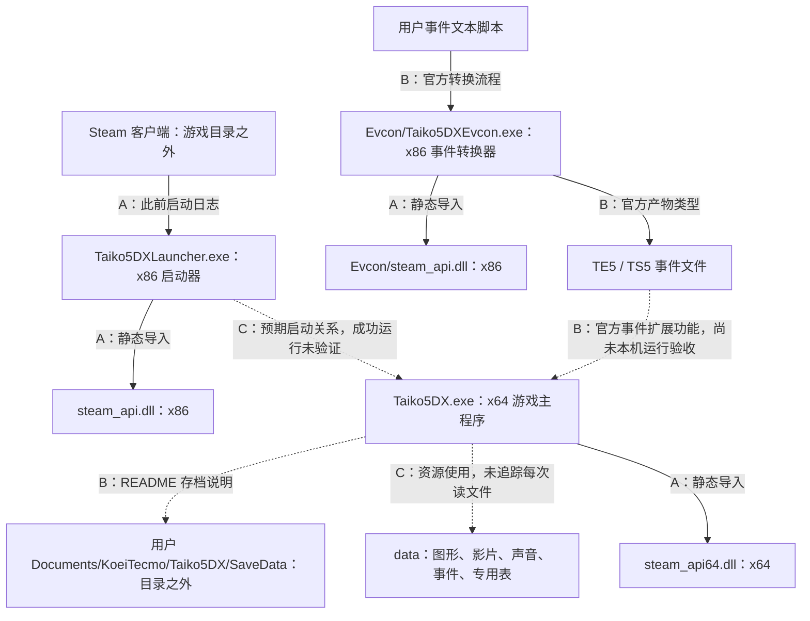

# 太阁立志传Ⅴ DX：文件分类与架构核查

## 架构结论与证据等级

目前可以建立“发行版文件架构”，尚不能建立开发者完整源码架构。下面区分三种证据：A＝本机文件/PE/日志实读，B＝官方文档说明，C＝尚待运行或格式解码验证的推断。

实线不统一表示运行时调用：每条边已标注静态、日志或官方流程证据。游戏主程序尚未成功启动，所以不能把虚线说成已实测运行链。

## 程序层与运行依赖

- 主程序 `Taiko5DX.exe`：x64，版本 1.2.1.0；负责游戏运行的角色结合产品文件名与布局确认，内部职业、交易、AI 等模块的具体函数位置未定位。
- 启动器 `Taiko5DXLauncher.exe`：x86，版本 1.0.0.0；此前日志记录 Steam 创建此进程。不能凭其退出码 51 宣布具体故障原因。
- `Evcon/Taiko5DXEvcon.exe`：x86，版本 1, 1, 0, 0。官方说明事件转换器允许编写文本事件并转换到游戏使用格式；并非游戏核心源码编译器。
- 三个 Valve DLL 分别配套 x86 启动器、x64 主程序、x86 事件转换器。它们属于 Steam API 接口发布库，不能替代完整 Steam 客户端。
- 所有 6 个 EXE/DLL 的 CLR 目录均为 0，因此不是普通 .NET 程序。所有签名在完整审计中显示 Valid；签名有效不等于运行一定正常。
- 主程序静态导入 DirectInput、XInput、IMM32、D3D9、D3D11、DXGI、D3DCOMPILER_43、Media Foundation 等库，支持“输入、图形、媒体与 Steam 接口”依赖分类；无法仅凭导入表判断实际采用的渲染分支或运行时加载结果。
- `.text`、`.rdata`、`.data`、`.rsrc` 等是 PE 内部节区，不是独立源码目录。EXE 中发现 `.bind` 节，但节名不足以确认保护方案、加密范围或错误原因；本轮不移除、不修改。

## 数据层：已知与未知

1. **事件层**：`EVENT`、`EVENT_SC`、`EVENT_TW` 各有 169 个 TE5 和 169 个 TS5，全部同名配对。官方确认这两个后缀为转换后的事件文件；JP/SC/TW 的语言角色可由布局及产品语言支持推断，文件内部内容及语言逐条对应尚未校对。没有将现有事件文件改写或导入。
2. **图形候选层**：183 个 G1T 的总大小约 6.05 GiB。实读文件头存在 `GT1G` 与 `MRLK` 等差异，说明同一扩展名不能假定内部全是同一种布局。RGBA8、TG5 另列图形候选，仍需格式验证，不能仅凭后缀宣布可直接转换。
3. **声音层**：`SOUND/STREAM` 中 40 个 KVS 文件，文件头 `KOVS`；`SOUND/SE` 有 8 对 WB2/WH2。位置、名称与头部支持声音资源分类；未解码播放，也未绕过可能的编码/保护。官方说明书注明 Ogg Vorbis 音频技术，但不能据此断言每个声音文件都直接可按 Ogg 播放。
4. **影片层**：5 个 WMV 文件，头部符合 ASF 签名字节；另有 `KOEI_LOGO.PMF`，头部 `PSMF`。分类基于实读签名，尚未逐帧核验。文件名 OP/ED/LOGO 支持开场/结尾/标志的用途推断，不替代播放验证。
5. **界面/场景/战斗候选层**：BASE、UI、CMENU、PBBATTLE、WAR、MG、FONT、TDATA、JP、MP 等均为实际目录。它们提示资源分组，但目录名无法证明对应独立引擎模块、算法或全部业务定义。
6. **消息与转换表**：TAI5MSG_JP/SC/TW.DAT、Evcon/T5EvDatTbl*.dat 等名称支持语言消息/转换表候选分类。格式、字符编码及字段未解析；不是可直接当 SQL 表或源码使用的文件。
7. **文档层**：3 个 README 均有 UTF-8 BOM。它们是产品使用说明，不是事件脚本；其中关闭安全软件的泛用建议与本公司约束冲突，未执行。

## 对后续路线的判断

最值得优先研究的是官方事件转换器的“文本脚本 → 事件条件/动作 → 游戏事件”接口，以及官方说明书中的角色、能力、技能、职业与交易规则。它比假定全部专用数据都能恢复源码更可验证；但事件扩展能力不等于可以重写核心引擎或成为操作系统。

如下一阶段需要运行验证，应先解决现有启动错误，再在独立工作区编写最小事件样例，记录转换产物和结果；本轮仅了解架构，没有运行转换器、创建 SCRIPT 目录或写入游戏安装目录。用于大秦赋的现实个人技能/职业模型应另建数据结构及实现，不复制游戏人物画像或将虚拟规则直接视为现实事实。

未发现源码工程并不证明所有资源中绝无脚本。文件头与哈希不能单独判断是否加密、是否包含隐藏对象、是否涉及监控；本轮未解包、反编译或执行游戏。没有安装工具、修改安全策略、删除或重排任何游戏文件。

## 官方依据

- [事件转换器功能](https://www.gamecity.ne.jp/manual/KSjyrFfh/Taiko5DXEV_JP/contents/editor.html)
- [事件文本与 TE5/TS5 转换产物说明](https://www.gamecity.ne.jp/manual/KSjyrFfh/Taiko5DXEV_JP/contents/friend.html)：页面中的删除示例只是文档内容，本轮未执行。
- [繁体中文游戏说明书：职业、能力、技能与流程](https://www.gamecity.com.tw/manual/taikou5dx/)
- [官方更新记录：事件转换器简繁中文支持及版本](https://www.gamecity.com.tw/taikou5dx/info_update.html)

逐文件证据见同目录 `分类文件清单.csv`；统计与配对验证见 `classification-summary.json`；完整哈希证据见 `all-files.csv`、`summary.json`。分类脚本 `classify.py` 每行代码均附注释。若重运行脚本，将重新生成下方统计基础报告；上述架构审阅部分是另外人工校对的解释。

当前目录/文件头复核：2026-10-02T16:19:16.609572+04:00。完整逐字节哈希基线：2026-10-02T16:06:48.863396+04:00。

共 1331 个文件，7,374,028,339 字节；本轮元数据/文件头变化 0，删除 0，读取错误 0。本轮未重复读取全部资源字节；完整读取证据来自上述哈希基线。

## 分门别类

| 分类 | 文件数 | 大小 MiB | 占总字节 |
|---|---:|---:|---:|
| 图像/图形候选资源 | 187 | 6199.431 | 88.155% |
| 影片资源 | 6 | 643.027 | 9.144% |
| 效果候选资源 | 13 | 0.387 | 0.005% |
| 其他专用数据 | 43 | 13.825 | 0.197% |
| 事件数据 | 1014 | 11.520 | 0.164% |
| 声音资源 | 56 | 116.340 | 1.654% |
| Steam 接口库 | 3 | 0.779 | 0.011% |
| 事件转换器配套表 | 3 | 0.783 | 0.011% |
| 程序 | 3 | 46.311 | 0.659% |
| 说明文档 | 3 | 0.018 | 0.000% |

## 实际目录

| 目录 | 直接文件数 | 直接文件大小 MiB |
|---|---:|---:|
| `.` | 7 | 35.751 |
| `Evcon` | 5 | 12.140 |
| `data` | 12 | 111.828 |
| `data\BASE` | 20 | 652.894 |
| `data\CMENU` | 26 | 59.872 |
| `data\CMENU\SNR` | 27 | 4.497 |
| `data\EFFECT` | 1 | 2.000 |
| `data\EVENT` | 338 | 3.647 |
| `data\EVENT_SC` | 338 | 3.932 |
| `data\EVENT_TW` | 338 | 3.941 |
| `data\FONT` | 4 | 57.631 |
| `data\JP` | 5 | 81.093 |
| `data\MG` | 23 | 342.306 |
| `data\MP` | 4 | 281.549 |
| `data\PBBATTLE` | 5 | 59.686 |
| `data\PBBATTLE\PBUNIT` | 71 | 4074.055 |
| `data\SAVELOAD` | 1 | 0.420 |
| `data\SOUND\SE` | 16 | 79.264 |
| `data\SOUND\STREAM` | 40 | 37.076 |
| `data\TDATA` | 8 | 854.610 |
| `data\UI` | 20 | 38.519 |
| `data\WAR` | 10 | 233.712 |
| `data\eff` | 12 | 1.999 |

## 事件文件配对

| 目录 | TE5 | TS5 | 同名配对 |
|---|---:|---:|---:|
| `data/EVENT` | 169 | 169 | 169 |
| `data/EVENT_SC` | 169 | 169 | 169 |
| `data/EVENT_TW` | 169 | 169 | 169 |

## 扩展名与实读文件头

| 扩展名 | 前八字节十六进制（最多列三种） |
|---|---|
| `.bin` | `0000000000000000` × 1 |
| `.dat` | `40010000c0e70000` × 1; `4001000040d70000` × 1; `4001000040d80000` × 1 |
| `.dll` | `4d5a900003000000` × 3 |
| `.efps` | `4b53454630313330` × 1 |
| `.exe` | `4d5a900003000000` × 3 |
| `.ftx` | `0600000002000000` × 1 |
| `.g1e` | `5846314735323030` × 6 |
| `.g1em` | `4d45314731303030` × 4 |
| `.g1s` | `5f53324733303030` × 1 |
| `.g1t` | `4754314734363030` × 87; `4d524c4b58000000` × 71; `4754314730363030` × 7 |
| `.kvs` | `4b4f56530f111400` × 1; `4b4f565368031600` × 1; `4b4f5653aeb40d00` × 1 |
| `.pmf` | `50534d4630303135` × 1 |
| `.rgba8` | `ffffff00ffffff00` × 2 |
| `.te5` | `be0200007c000000` × 30; `7e05000061000000` × 24; `5f01000024000000` × 9 |
| `.tg5` | `544b355012000100` × 2 |
| `.tr5` | `494c4e4b18000000` × 27; `0000130113011301` × 1; `0ffe0ffe0ffe0ffe` × 1 |
| `.ts5` | `0000500001000000` × 3; `00fa510104000000` × 3; `0006520101000000` × 3 |
| `.txt` | `efbbbf3d3d3d3d3d` × 3 |
| `.wb2` | `5f44425730303030` × 8 |
| `.wh2` | `5f48425730303030` × 8 |
| `.wmv` | `3026b2758e66cf11` × 5 |
